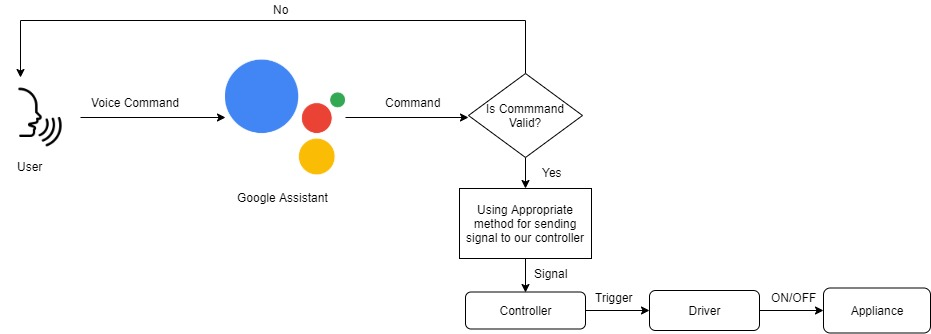

# IOT Based Smart Home Assistant
Operating various home appliances and modules remotely along with saving energy are the prominent factors possessed by Smart Home. If we look at the existing systems, we have Google home and Amazon echo providing the functionalities such as switching on/off appliances remotely from anywhere.
This project focuses primarily on a smart home system that allows users to control any electrical appliance using their smart phone google assistant. Apart from this the system also helps in keeping a track on air quality, sound and light intensity, temperature and humidity of their home. 
It also provides analysis of the aforesaid parameters using various graphical methods. It also takes care of user’s safety as it informs about gas leakage and fire detection preventing from any major damage.
A need for these kind of systems is seen in the society given the benefits they provide.Convenience, security, time management, and connectivity act as prominent factors to motivate and build a system like Smart Home.

## Proposed System
The project consists of different modules which perform their respective tasks and are integrated as a whole to make one complete system, the proposed system is divided into three different modules which are a software module, hardware module and a module where the appliances can be controlled through the Google assistant.

The above system proposes how the user can control the appliances through a voice command using google assistant. According to the proposed system the user needs to give a voice command to the google assistant the command will be validated. Once a valid command is said the method, which in this project is IFTTT and MQTT Broker will be used to send the signal to the controller. The controller will then trigger the driver and the required operation is performed.

According to the above proposed system, the controller will have n number of input and output channels depending on the user requirements, it also includes a wifi module along with an external power supply. All the sensors namely motion, temperature, humidity, fire, gas, sound intensity, light intensity pass their sensor value to the input channel, the output channel will be used to trigger the appliances. Our controller requires an inbuilt wifi module to connect to the MQTT Broker through the gateway.

The software module consists of an android application, through this application the user can monitor all the appliances and also monitor and analyze all the sensor values. The user will also receive a notification if any of the incidents such as intrusion, gas leakage or fire breakage occurs. The controller sends all the values to the database in real time, all these values can be monitored by the user once the user logs in to the android application.
